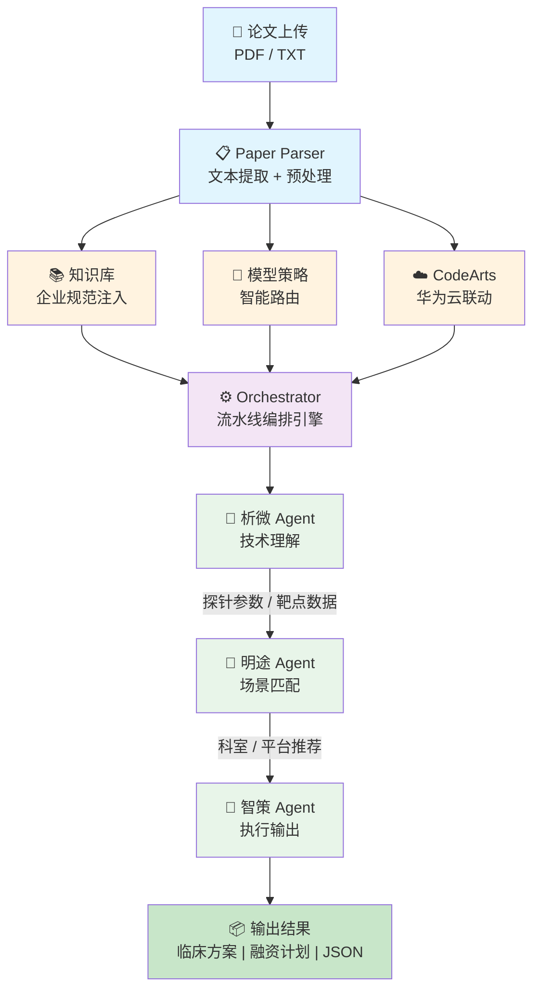

# 转化医学 Agent — 从实验室到临床

[](https://developer.huaweicloud.com/competition/information/1300000255/html1)
[](https://developer.huawei.com/consumer/cn/)
[](https://python.org)

> **华为云杯 2026 人工智能 OPC 应用创新大赛参赛作品**
> 基于大语言模型的医学论文智能分析系统，实现从技术理解 → 场景匹配 → 执行输出的全自动 Agent 流水线。

---

## 系统架构



### 三个 Agent

| Agent | 模块 | 功能 |
|-------|------|------|
| **析微 (XiWei)** | `agents/tech_understanding.py` | 提取探针参数（名称、类型、靶点、激活机制等） |
| **明途 (MingTu)** | `agents/scene_matching.py` | 匹配推荐科室、TOP3 适配手术平台/成像平台 |
| **智策 (ZhiCe)** | `agents/execution_output.py` | 生成 I 期临床试验设计方案、创新医疗器械融资计划书 |

## 快速开始

### 安装依赖

```bash
pip install -r requirements.txt
```

### Web 界面（推荐）

```bash
streamlit run web/app.py
```

### 命令行模式

```bash
python main.py sample_paper.txt
python main.py 真实论文/fchem-06-00485.pdf
```

### API 服务

```bash
ENABLE_HARMONY_API=true uvicorn api.main:app --host 0.0.0.0 --port 8000
```

## 核心特性

### 多模型支持

支持 DeepSeek、GPT-4o、华为云 CodeArts 盘古等多种 LLM，可按 Agent 类型智能路由：

```json
{
  "agent_mapping": {
    "tech_understanding": ["codearts-pangu", "deepseek-chat"],
    "scene_matching": ["deepseek-chat", "gpt-4o"],
    "execution_output": ["gpt-4o", "deepseek-chat"]
  }
}
```

配置方式：编辑 `config/model_strategy.json`，在 `.env` 中设置 `ENABLE_MODEL_STRATEGY=true`。

### 私有知识库注入

为每个 Agent 注入企业规范/领域知识：
- `knowledge/tech_understanding/` — 医疗探针技术规范
- `knowledge/scene_matching/` — 手术机器人兼容性标准
- `knowledge/execution_output/` — NMPA 临床试验规范

启用方式：`.env` 中设置 `ENABLE_KNOWLEDGE_BASE=true`。

### 华为云 CodeArts 生态联动

- 集成 CodeArts LLM 服务
- 超时控制（30s）+ 重试机制（3 次）
- 故障自动降级到备用模型
- 审计日志

### HarmonyOS 鸿蒙适配

跨端 ArkTS 应用，支持手机/平板/电视：

```
harmonyos/entry/src/main/ets/
├── pages/
│   ├── Index.ets          # 论文上传 + 实时进度
│   └── ResultView.ets     # 分析结果展示
└── components/
    ├── UploadCard.ets      # 上传组件
    ├── ProgressPanel.ets   # 进度面板（WebSocket）
    └── ResultCard.ets      # 结果卡片
```

API 端点：
- `POST /api/v1/analyze` — 上传论文启动流水线
- `GET /api/v1/analyze/{task_id}` — 查询任务状态
- `WebSocket /api/v1/ws/{task_id}` — 实时进度推送

## 项目结构

```
├── main.py                  # CLI 入口
├── web/app.py               # Streamlit Web UI
├── api/                     # FastAPI 后端（鸿蒙适配）
├── agents/                  # AI Agent 模块
│   ├── tech_understanding.py  # 析微
│   ├── scene_matching.py      # 明途
│   └── execution_output.py    # 智策
├── core/                    # 核心引擎
│   ├── orchestrator.py        # 流水线编排
│   ├── llm_client.py          # LLM 客户端
│   └── codearts_client.py     # CodeArts 集成
├── models/                  # 多模型适配层
│   ├── manager.py             # 模型管理
│   ├── strategy.py            # 路由策略
│   └── fallback.py            # 故障转移
├── knowledge/               # 知识库
├── input/                   # 论文解析
├── harmonyos/               # 鸿蒙前端
├── config/                  # 配置文件
└── spec/                    # 设计文档
```

## 环境变量

| 变量 | 说明 | 默认值 |
|------|------|--------|
| `LLM_API_KEY` | LLM API Key | — |
| `LLM_BASE_URL` | API 地址 | `https://api.deepseek.com/v1` |
| `LLM_MODEL` | 模型名 | `deepseek-chat` |
| `ENABLE_CODEARTS_LLM` | 启用 CodeArts | `false` |
| `ENABLE_KNOWLEDGE_BASE` | 启用知识库 | `false` |
| `ENABLE_MODEL_STRATEGY` | 启用多模型策略 | `false` |
| `ENABLE_HARMONY_API` | 启用鸿蒙 API | `false` |

---

华为云杯 2026 人工智能 OPC 应用创新大赛参赛作品。
