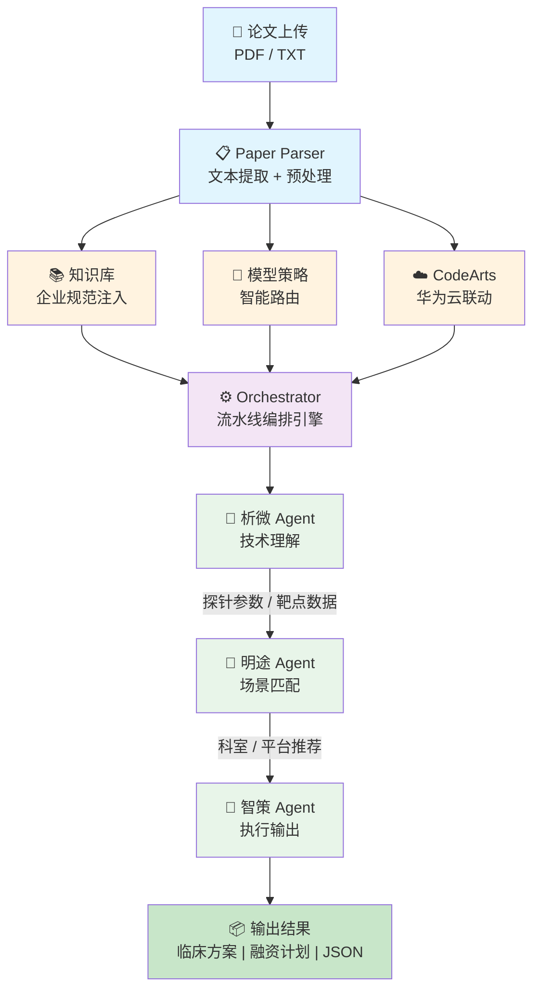

# 转化医学 Agent — 从实验室到临床

[](https://developer.huaweicloud.com/competition/information/1300000255/html1)
[](https://developer.huawei.com/consumer/cn/)
[](https://python.org)

> **华为云杯 2026 人工智能 OPC 应用创新大赛参赛作品**
> 基于大语言模型的医学论文智能分析系统，实现从技术理解 → 场景匹配 → 执行输出的全自动 Agent 流水线。

---

## 系统架构



**数据流：** 上传论文 → 解析 PDF/TXT → 析微提取参数 → 明途匹配平台 → 智策生成文档 → 缓存结果

### 三个 Agent

| Agent | 模块 | 职责 |
|-------|------|------|
| **析微 (XiWei)** | `agents/tech_understanding.py` | 技术理解，提取探针参数（名称、类型、靶点、激活机制等） |
| **明途 (MingTu)** | `agents/scene_matching.py` | 场景匹配，推荐手术平台与科室 |
| **智策 (ZhiCe)** | `agents/execution_output.py` | 执行输出，生成临床方案与融资计划 |

---

## 环境安装

```bash
pip install -r requirements.txt
```

如果 `pip` 未识别，改用：

```bash
python -m pip install -r requirements.txt
```

> 需要 Python 3.10 以上。检查版本：`python --version`

---

## 启动与运行

### Web 界面（推荐）

```bash
python -m streamlit run web/app.py
```

### 命令行模式

```bash
python main.py sample_paper.txt
python main.py 真实论文/fchem-06-00485.pdf
python main.py 真实论文/chen-et-al-2024-tumor-specific-cascade-recognition-of-activatable-probes-for-fluorescence-navigation-surgery.pdf
python main.py 真实论文/fonc-09-00727.pdf
```

### API 服务（鸿蒙适配）

```bash
uvicorn api.main:app --host 0.0.0.0 --port 8000
```

---

## 缓存与结果管理

### 清除缓存

```bash
# Linux/Mac — 清除 Python 缓存
find . -type d -name "__pycache__" -exec rm -rf {} +

# Windows PowerShell — 清除 Python 缓存
Get-ChildItem -Recurse -Directory -Filter "__pycache__" | Remove-Item -Recurse -Force

# 清除项目结果缓存
rm -rf output/.cache/
```

### 查看结果

```bash
# 完整 JSON 结果
cat output/full_result.json

# 生成的临床试验方案
ls output/临床试验设计方案_PhaseI_*.md

# 生成的融资计划书
ls output/创新医疗器械融资计划书_*.md
```

### 停止服务

```bash
# Windows PowerShell
taskkill /F /IM streamlit.exe

# Linux / Mac
pkill -f streamlit
```

---

## 切换模型

### 方式一：基础模式（编辑 .env）

```bash
# 当前使用 DeepSeek
LLM_API_KEY=sk-your-key
LLM_BASE_URL=https://api.deepseek.com/v1
LLM_MODEL=deepseek-chat

# 如需切换到 OpenAI：
# LLM_API_KEY=sk-your-openai-key
# LLM_BASE_URL=https://api.openai.com/v1
# LLM_MODEL=gpt-4o
```

修改上述三行即可切换任意兼容 OpenAI 接口的模型。

### 方式二：多模型智能路由（华为云码道特色能力）

**步骤 1** — 编辑 `.env`，启用多模型策略：

```bash
ENABLE_MODEL_STRATEGY=true
MODEL_STRATEGY_PATH=config/model_strategy.json
```

**步骤 2** — 编辑 `config/models.json`，配置多个模型：

```json
{
  "models": [
    {
      "model_name": "deepseek-chat",
      "api_key": "sk-your-key",
      "base_url": "https://api.deepseek.com/v1",
      "enabled": true,
      "priority": 5,
      "provider": "deepseek"
    },
    {
      "model_name": "gpt-4o",
      "api_key": "sk-your-openai-key",
      "base_url": "https://api.openai.com/v1",
      "enabled": true,
      "priority": 8,
      "provider": "openai"
    },
    {
      "model_name": "codearts-pangu",
      "api_key": "your-codearts-key",
      "base_url": "https://console.huaweicloud.com/api-codearts/v1",
      "enabled": true,
      "priority": 10,
      "provider": "codearts"
    }
  ]
}
```

**步骤 3** — 编辑 `config/model_strategy.json`，配置路由策略：

```json
{
  "mode": "auto",
  "agent_mapping": {
    "tech_understanding": ["codearts-pangu", "deepseek-chat"],
    "scene_matching": ["deepseek-chat", "gpt-4o"],
    "execution_output": ["gpt-4o", "deepseek-chat"]
  },
  "fallback_models": ["deepseek-chat", "gpt-4o"],
  "switch_threshold": 3
}
```

**策略说明：**

| Agent | 首选模型 | 原因 |
|-------|---------|------|
| 析微 (XiWei) | CodeArts 盘古 | 参数提取能力强 |
| 明途 (MingTu) | DeepSeek | 推理能力强 |
| 智策 (ZhiCe) | GPT-4o | 文档生成能力强 |

- 策略化选择：按 Agent 类型自动选择最适合的模型
- 手动指定：支持用户手动切换当前模型
- 故障转移：模型连续失败 3 次自动切换备用模型
- 健康检查：启动时验证所有模型可用性

---

## 华为云码道特色能力

### 1. CodeArts 生态联动

启用方式：

```bash
ENABLE_CODEARTS_LLM=true
MODEL_CONFIG_PATH=config/models.json
```

- 集成华为云 CodeArts LLM 服务，支持盘古等自研模型
- 超时控制（默认 30s）+ 重试机制（最多 3 次）
- CodeArts 调用失败自动降级到备用模型
- 记录每次调用的审计日志

### 2. 私有知识库 / 企业规范对齐

启用方式：

```bash
ENABLE_KNOWLEDGE_BASE=true
KNOWLEDGE_CONFIG_PATH=knowledge/knowledge_config.json
```

**知识库结构：**

```
knowledge/knowledge/
├── tech_understanding/              # 析微 Agent 知识
│   └── 医疗探针技术规范.txt          # 光学性质、体外性能、安全性、靶向策略
├── scene_matching/                  # 明途 Agent 知识
│   └── 手术机器人兼容性标准.txt       # 平台分类、技术规格、市场装机量
└── execution_output/                # 智策 Agent 知识
    └── NMPA临床试验规范.txt           # I 期试验设计、伦理审查、数据管理
```

**功能：**

- 知识库内容自动注入到对应 Agent 的 system_prompt
- 支持 TXT、MD、JSON 格式
- 懒加载：仅在 Agent 调用时加载对应知识库
- 文件内容缓存：避免重复读取
- 长度控制：注入后的总 Prompt 不超过 4096 字符

**添加新知识：**

1. 在 `knowledge/knowledge/<Agent目录>/` 下创建知识文件
2. 在 `knowledge/knowledge_config.json` 中添加配置：

```json
{
  "file_path": "knowledge/knowledge/tech_understanding/新知识.txt",
  "target_agents": ["tech_understanding"],
  "content_type": "enterprise_standard",
  "max_length": 10000
}
```

### 3. 多模型切换

见上方「切换模型 → 方式二」，额外功能包括策略化选择、手动指定、故障转移、健康检查。

### 4. 鸿蒙适配

启用方式：

```bash
ENABLE_HARMONY_API=true
API_HOST=0.0.0.0
API_PORT=8000
```

**API 接口：**

| 方法 | 路径 | 说明 |
|------|------|------|
| `POST` | `/api/v1/analyze` | 上传论文并启动 Agent 流水线 |
| `GET` | `/api/v1/analyze/{task_id}` | 查询任务状态 |
| `GET` | `/api/v1/analyze/{task_id}/result` | 获取分析结果 |
| `DELETE` | `/api/v1/analyze/{task_id}` | 取消任务 |
| `GET` | `/api/v1/models` | 获取所有可用模型 |
| `PUT` | `/api/v1/models/switch` | 手动切换当前模型 |
| `GET` | `/api/v1/knowledge` | 获取知识库加载状态 |
| `POST` | `/api/v1/knowledge/refresh` | 手动刷新知识库缓存 |
| `WS` | `/api/v1/ws/{task_id}` | 实时进度推送 (WebSocket) |

**鸿蒙应用结构：**

```
harmonyos/entry/src/main/ets/
├── pages/
│   ├── Index.ets              # 论文上传 + 实时进度显示
│   └── ResultView.ets         # 析微、明途、智策结果展示，文档下载
└── components/
    ├── UploadCard.ets          # 上传卡片组件
    ├── ProgressPanel.ets       # 进度面板组件 (WebSocket 连接)
    └── ResultCard.ets          # 结果卡片组件
```

**跨端运行：** 支持手机、平板、电视等鸿蒙设备，响应式布局自动适配不同屏幕尺寸。

---

## 项目结构

```
├── main.py                     # CLI 入口
├── web/app.py                  # Streamlit Web UI
├── api/                        # FastAPI 后端（鸿蒙适配）
│   ├── routes.py
│   ├── models.py
│   └── websocket.py
├── agents/                     # AI Agent 模块
│   ├── tech_understanding.py   # 析微 — 技术理解
│   ├── scene_matching.py       # 明途 — 场景匹配
│   └── execution_output.py     # 智策 — 执行输出
├── core/                       # 核心引擎
│   ├── orchestrator.py         # 流水线编排
│   ├── llm_client.py           # LLM 客户端
│   ├── codearts_client.py      # CodeArts 集成
│   ├── health_checker.py       # 健康检查
│   ├── cache.py                # 缓存管理
│   ├── prompts.py              # Prompt 模板
│   └── json_parser.py          # JSON 解析器
├── models/                     # 多模型适配层
│   ├── manager.py              # 模型管理
│   ├── strategy.py             # 路由策略
│   ├── fallback.py             # 故障转移
│   ├── openai_adapter.py       # OpenAI 适配器
│   └── codearts_adapter.py     # CodeArts 适配器
├── knowledge/                  # 私有知识库
│   ├── manager.py              # 知识库加载/管理
│   ├── injector.py             # Prompt 注入
│   ├── watcher.py              # 文件监控
│   └── knowledge/              # 知识文件目录
├── input/                      # 论文解析
├── harmonyos/                  # 鸿蒙前端
├── config/                     # 配置文件
├── spec/                       # 设计文档
└── 真实论文/                    # 测试用真实论文
```

---

## 环境变量

| 变量 | 说明 | 默认值 |
|------|------|--------|
| `LLM_API_KEY` | LLM API Key | — |
| `LLM_BASE_URL` | API 地址 | `https://api.deepseek.com/v1` |
| `LLM_MODEL` | 模型名 | `deepseek-chat` |
| `ENABLE_CODEARTS_LLM` | 启用 CodeArts 联动 | `false` |
| `ENABLE_KNOWLEDGE_BASE` | 启用知识库注入 | `false` |
| `ENABLE_MODEL_STRATEGY` | 启用多模型智能路由 | `false` |
| `ENABLE_HARMONY_API` | 启用鸿蒙 API 服务 | `false` |
| `API_HOST` | API 监听地址 | `0.0.0.0` |
| `API_PORT` | API 端口 | `8000` |

---

华为云杯 2026 人工智能 OPC 应用创新大赛参赛作品。
