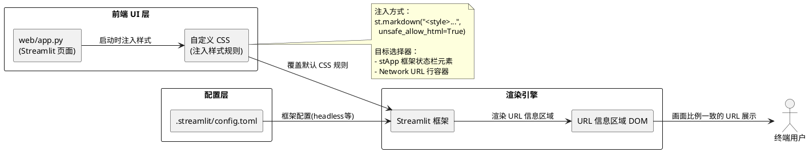
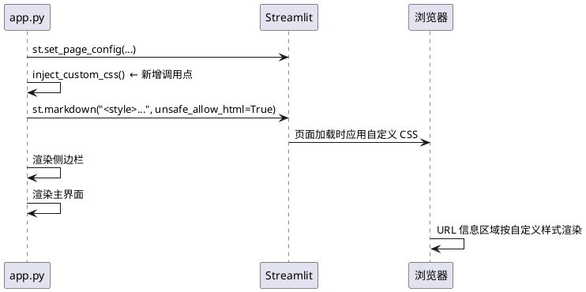

# **1. 实现模型**

## **1.1 上下文视图**

本组件位于智慧医疗 Agent Web UI 层，通过向 Streamlit 应用注入自定义 CSS 样式，覆盖框架默认渲染，使 Network URL 与 Local URL 的画面比例（字体大小、行高、间距）完全一致。不涉及后端逻辑、Agent 工作流或数据处理。



## **1.2 服务/组件总体架构**

本组件不引入新服务，仅在现有 `web/app.py` 文件中新增 CSS 注入代码，并可选地调整 `.streamlit/config.toml` 配置。修改后的组件结构如下：

| 组件 | 类型 | 职责 | 修改类型 |
|------|------|------|----------|
| `web/app.py` | Streamlit 页面文件 | Web 交互界面的入口与布局定义，新增 CSS 样式注入 | 新增代码段 |
| `.streamlit/config.toml` | Streamlit 配置文件 | 框架运行时配置（当前已有 `headless = true`） | 可选补充配置 |

**修改清单：**

| 序号 | 修改位置 | 修改内容 | 修改类型 |
|------|---------|---------|----------|
| 1 | `web/app.py` L22 之后 | 新增 `inject_custom_css()` 函数调用，注入 URL 显示比例调整的 CSS 规则 | 新增代码段 |
| 2 | `web/app.py` 文件中部 | 新增 `inject_custom_css()` 函数定义，包含 CSS 样式字符串和 `st.markdown` 注入逻辑 | 新增函数 |

**保持不变的位置：**

| 位置 | 内容 | 不修改原因 |
|------|------|-----------|
| `web/app.py` L16-21 | `st.set_page_config(...)` | 页面配置与 URL 显示样式无关 |
| `web/app.py` 侧边栏代码 | 侧边栏所有组件 | 非本次需求范围 |
| `web/app.py` 主界面代码 | 论文上传、执行等逻辑 | 非本次需求范围 |
| `.streamlit/config.toml` `[server]` | `headless = true` | 保持现有 headless 配置不变 |

## **1.3 实现设计文档**

### **1.3.1 URL 显示比例调整实现**

**策略：通过 `st.markdown` 注入自定义 CSS 覆盖 Streamlit 默认样式**

Streamlit 应用启动后在浏览器页面中渲染 URL 信息区域（包含 Local URL 和 Network URL），该区域由框架自动生成，其 DOM 元素具有特定的 CSS 类名和默认样式。当 Network URL 的画面比例（字体大小、行高、间距）与 Local URL 不一致时，需通过注入高优先级 CSS 规则将其对齐。

**技术方案选型分析：**

| 方案 | 描述 | 优势 | 劣势 | 是否采用 |
|------|------|------|------|---------|
| A: `st.markdown` 注入 CSS | 在 `app.py` 中通过 `st.markdown("<style>...", unsafe_allow_html=True)` 注入 | 集中管理、无需额外文件、与代码版本控制一致 | CSS 字符串嵌入 Python 代码 | ✅ 采用 |
| B: `static/` 目录 + CSS 文件 | 在项目 `static/` 目录下创建 CSS 文件 | 样式文件独立、可复用 | 需配置 Streamlit 的 `server.staticDir`、需额外目录结构 | ❌ 不采用 |
| C: `.streamlit/config.toml` 配置 | 通过配置文件调整样式 | 配置集中 | config.toml 不支持自定义 CSS 注入，仅支持有限的主题配置 | ❌ 不采用 |

**选定方案 A 的实现细节：**

1. **CSS 注入函数**：在 `web/app.py` 中定义 `inject_custom_css()` 函数
2. **CSS 规则内容**：针对 Streamlit URL 信息区域的 Network URL 行元素，设置与 Local URL 一致的样式属性
3. **注入时机**：在 `st.set_page_config()` 之后、侧边栏和主界面渲染之前调用，确保样式在页面渲染时即时生效
4. **CSS 选择器策略**：使用 Streamlit 框架的内部 CSS 类名作为选择器，通过 `!important` 提升优先级确保覆盖框架默认样式

**CSS 样式规则设计：**

```css
/* 目标：将 Network URL 行的样式与 Local URL 行对齐 */
/* Streamlit URL 信息区域的选择器基于框架内部 DOM 结构 */

/* 规则 1：Network URL 文本字体大小对齐 Local URL */
[data-testid="stSidebar"] ... {
    font-size: inherit !important;
}

/* 规则 2：Network URL 行高对齐 Local URL */
... {
    line-height: inherit !important;
}

/* 规则 3：Network URL 间距对齐 Local URL */
... {
    margin-top: 0 !important;
    margin-bottom: 0 !important;
    padding: inherit !important;
}
```

> **注意**：上述 CSS 选择器为示意结构，实际选择器需通过浏览器开发者工具（DevTools）检查 Streamlit 渲染后的 DOM 确定。Streamlit 版本更新可能导致 DOM 结构和类名变化，需在实现时实际调试确认。

**`inject_custom_css()` 函数设计：**

```python
def inject_custom_css():
    """注入自定义 CSS，使 Network URL 与 Local URL 的画面比例一致。"""
    custom_css = """
    <style>
    /* ... 具体 CSS 规则 ... */
    </style>
    """
    st.markdown(custom_css, unsafe_allow_html=True)
```

### **1.3.2 CSS 选择器发现与验证策略**

由于 Streamlit 框架的 URL 信息区域 DOM 结构未公开文档化，需通过以下步骤发现并验证 CSS 选择器：

1. **启动应用**：执行 `streamlit run web/app.py`，在浏览器中打开应用
2. **打开 DevTools**：按 F12 打开浏览器开发者工具
3. **定位 URL 区域**：在 Elements 面板中搜索包含 "Local URL" 或 "Network URL" 文本的 DOM 节点
4. **分析样式差异**：在 Computed 面板中对比 Local URL 和 Network URL 元素的 `font-size`、`line-height`、`margin`、`padding` 属性值
5. **编写覆盖规则**：基于差异编写 CSS 覆盖规则，使用 `!important` 确保优先级
6. **实时验证**：在 DevTools 的 Styles 面板中临时添加规则，确认 Network URL 画面比例与 Local URL 对齐
7. **固化到代码**：将验证通过的 CSS 规则写入 `inject_custom_css()` 函数

### **1.3.3 样式注入位置与执行顺序**



**关键约束：**
- `inject_custom_css()` 必须在 `st.set_page_config()` 之后调用（Streamlit 要求 `set_page_config` 为首个命令）
- `inject_custom_css()` 应在侧边栏和主界面渲染之前调用，确保样式在 URL 信息区域渲染时已生效
- CSS 注入使用 `unsafe_allow_html=True` 参数，需确保 CSS 内容不含恶意代码

### **1.3.4 验证策略**

修改完成后，需执行以下验证：

1. **CSS 注入验证**：启动应用后，在浏览器 DevTools 中确认自定义 CSS 规则已被加载到 DOM 中
2. **样式属性验证**：在 DevTools 的 Computed 面板中，对比 Local URL 和 Network URL 元素的 `font-size`、`line-height`、`margin`、`padding` 值，确认完全一致
3. **视觉对比验证**：肉眼观察 Local URL 和 Network URL 的画面比例，确认无差异
4. **URL 可访问性验证**：点击 Local URL 和 Network URL 链接，确认均可正确跳转
5. **URL 地址完整性验证**：确认 Local URL 地址为 `http://localhost:{port}`，Network URL 地址为 `http://{ip}:{port}`，内容未被修改
6. **Local URL 样式不变验证**：对比调整前后 Local URL 的显示效果，确认 Local URL 样式未被改变
7. **移除回退验证**：注释掉 `inject_custom_css()` 调用并重启应用，确认 URL 信息区域恢复为框架默认样式
8. **跨浏览器验证**：在 Chrome、Firefox、Edge 中分别验证样式效果一致

# **2. 接口设计**

## **2.1 总体设计**

本次修改为纯前端 CSS 样式注入，不涉及新增后端接口或修改现有接口。CSS 通过 Streamlit 的 `st.markdown` API 注入到页面 DOM 中，由浏览器在渲染时应用。

**CSS 注入接口：**

| 接口 | 类型 | 方向 | 描述 |
|------|------|------|------|
| `st.markdown(html, unsafe_allow_html=True)` | Streamlit API | App → Browser | 将自定义 CSS 规则注入页面 `<head>` 区域 |
| 浏览器 CSS 引擎 | 运行时 | Browser → DOM | 解析并应用 CSS 规则，覆盖框架默认样式 |

## **2.2 接口清单**

| 接口名称 | 类型 | 入参 | 出参 | 描述 |
|---------|------|------|------|------|
| `inject_custom_css()` | 内部函数 | 无 | 无 | 封装 CSS 注入逻辑，调用 `st.markdown` 将样式规则写入页面 |
| `st.markdown(custom_css, unsafe_allow_html=True)` | Streamlit API | `custom_css: str`（含 `<style>` 标签的 HTML 字符串） | 无 | 将 HTML/CSS 内容渲染到页面 |

**函数签名：**

```python
def inject_custom_css() -> None:
    """注入自定义 CSS，使 Network URL 与 Local URL 画面比例一致。

    将包含覆盖规则的 <style> 标签通过 st.markdown 注入到 Streamlit 页面中，
    确保在 URL 信息区域渲染时自定义样式已生效。
    """
```

# **4. 数据模型**

## **4.1 设计目标**

本次修改不涉及数据模型变更。仅通过 CSS 样式覆盖调整 URL 信息区域的视觉呈现，不改变任何数据结构、数据流或数据存储方式。

## **4.2 模型实现**

**CSS 样式属性定义（对齐目标）：**

| 属性名 | 类型 | 描述 | 约束 |
|--------|------|------|------|
| `font_size` | `str` (CSS值) | Network URL 字体大小 | 必须等于 Local URL 的 `font-size` 计算值 |
| `line_height` | `str` (CSS值) | Network URL 行高 | 必须等于 Local URL 的 `line-height` 计算值 |
| `margin_top` | `str` (CSS值) | Network URL 元素上外边距 | 必须等于 Local URL 对应位置的 `margin-top` 值 |
| `margin_bottom` | `str` (CSS值) | Network URL 元素下外边距 | 必须等于 Local URL 对应位置的 `margin-bottom` 值 |
| `padding` | `str` (CSS值) | Network URL 元素内边距 | 必须等于 Local URL 对应位置的 `padding` 值 |

**CSS 选择器信息：**

| 字段 | 类型 | 描述 |
|------|------|------|
| `selector` | `str` | 目标 DOM 元素的 CSS 选择器字符串 |
| `priority` | `str` | 优先级策略，固定为 `!important` |
| `scope` | `str` | 作用范围，限定为 URL 信息区域内的 Network URL 行元素 |

**URL 地址信息（只读，不可修改）：**

| 字段 | 类型 | 描述 | 约束 |
|------|------|------|------|
| `local_url` | `str` | 格式 `http://localhost:{port}` | 调整样式后值不变 |
| `network_url` | `str` | 格式 `http://{ip}:{port}` | 调整样式后值不变 |
| `url_visible` | `bool` | URL 是否可见 | 保持 `true` |
