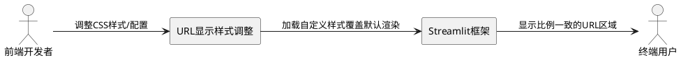
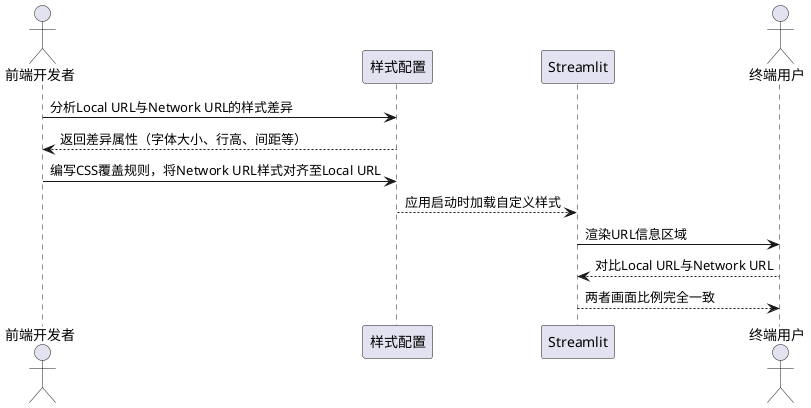
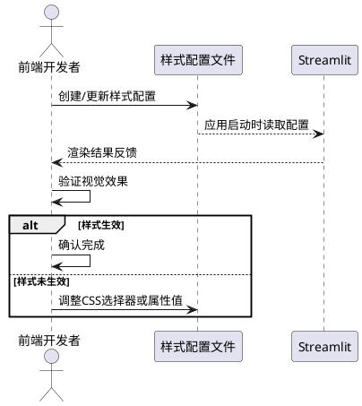

# **1. 组件定位**

## **1.1 核心职责**

本组件负责调整 Streamlit 应用启动信息中 Network URL 的显示比例，实现与 Local URL 画面比例的一致性。

## **1.2 核心输入**

1. Streamlit 框架启动时自动生成的 Local URL 和 Network URL 显示区域
2. 当前 Network URL 与 Local URL 的字体大小、行高、间距等样式属性（存在差异）
3. 用户对 URL 显示区域样式一致性的调整需求

## **1.3 核心输出**

1. 更新后的自定义 CSS 样式或 Streamlit 配置，使 Network URL 与 Local URL 的画面比例一致
2. 应用启动后终端/页面中 URL 信息区域的视觉呈现效果一致

## **1.4 职责边界**

1. 本组件不负责修改 Streamlit 框架核心渲染引擎的行为
2. 本组件不负责修改 URL 本身的生成逻辑（如端口号、地址绑定）
3. 本组件不负责修改应用主体界面（侧边栏、主内容区、页脚）的样式
4. 本组件不负责修改 Network URL 或 Local URL 的链接跳转行为

# **2. 领域术语**

**Local URL**
: Streamlit 应用启动后在本地回环地址（如 `http://localhost:8501`）上提供的访问地址，仅本机可访问。

**Network URL**
: Streamlit 应用启动后在局域网地址（如 `http://192.168.x.x:8501`）上提供的访问地址，同一网络中的其他设备可访问。

**URL 信息区域**
: Streamlit 应用启动后在终端或页面顶部显示的包含 Local URL 和 Network URL 的区域，由 Streamlit 框架自动渲染。

**画面比例**
: URL 信息区域中各元素的视觉尺寸关系，包括字体大小、行高、字间距、元素间距等 CSS 样式属性的综合表现。

**样式一致性**
: Local URL 与 Network URL 在字体大小、行高、间距等视觉属性上完全对齐，不存在可感知的视觉差异。

# **3. 角色与边界**

## **3.1 核心角色**

- 前端开发者：负责定位并修改 Streamlit URL 信息区域的 CSS 样式，使 Network URL 与 Local URL 画面比例一致
- 产品负责人：定义样式一致性验收标准，确认最终视觉效果

## **3.2 外部系统**

- Streamlit 框架：负责渲染启动信息中的 URL 区域，其默认样式可能导致 Network URL 与 Local URL 显示比例不一致
- 终端用户浏览器：最终展示调整后 URL 信息区域的客户端

## **3.3 交互上下文**

# **4. DFX约束**

## **4.1 性能**

- 样式调整不应引入额外的页面加载延迟（CSS 覆盖为浏览器原生行为，无性能损耗）
- The Streamlit 应用 shall 在应用启动后 1 秒内完成 URL 信息区域的样式渲染

## **4.2 可靠性**

- 样式调整后，Local URL 和 Network URL 均必须正确显示且可点击访问
- When Streamlit 框架版本升级，the 自定义样式 shall 仍能正常生效或可被快速适配

## **4.3 安全性**

- 本次修改为纯 CSS 样式调整，不涉及用户输入、认证鉴权或数据传输，无安全风险变更

## **4.4 可维护性**

- 自定义样式应集中管理（如 `.streamlit/config.toml` 或独立 CSS 文件），便于后续维护
- 样式变更应通过版本控制（Git）记录，便于回溯

## **4.5 兼容性**

- 调整后的 URL 信息区域应在所有主流浏览器（Chrome、Firefox、Edge、Safari）中正常显示
- 不改变 Streamlit URL 区域的 DOM 结构和链接行为，保持与现有框架版本的兼容性

# **5. 核心能力**

## **5.1 Network URL 画面比例调整**

### **5.1.1 业务规则**

1. **Network URL 字体大小对齐**：Network URL 的字体大小必须与 Local URL 的字体大小一致
   - 验收条件：[用户启动应用并查看 URL 信息区域] → [Network URL 的字体大小与 Local URL 完全相同]

2. **Network URL 行高对齐**：Network URL 的行高必须与 Local URL 的行高一致
   - 验收条件：[用户启动应用并查看 URL 信息区域] → [Network URL 的行高与 Local URL 完全相同]

3. **Network URL 间距对齐**：Network URL 与相邻元素之间的间距必须与 Local URL 的对应间距一致
   - 验收条件：[用户启动应用并查看 URL 信息区域] → [Network URL 的上下间距与 Local URL 对称一致]

4. **Network URL 整体画面比例对齐**：Network URL 的整体画面比例（字体大小、行高、间距的综合视觉效果）必须与 Local URL 保持一致，不得出现 Network URL 显示比例过大的情况
   - 验收条件：[用户启动应用并对比 Local URL 与 Network URL] → [两者在视觉上无比例差异]

5. **URL 可访问性保持**：调整样式后，Local URL 和 Network URL 必须仍为可点击的超链接，点击后能正确跳转到对应地址
   - 验收条件：[用户点击 Local URL 或 Network URL] → [浏览器正确打开对应地址的应用页面]

6. **禁止项**：禁止修改 URL 的地址内容（IP 地址、端口号）
   - 验收条件：[用户启动应用] → [Local URL 和 Network URL 的地址内容与调整前完全一致]

7. **禁止项**：禁止修改 Local URL 的现有样式作为适配手段
   - 验收条件：[用户启动应用] → [Local URL 的显示效果与调整前保持一致，仅 Network URL 被调整]

### **5.1.2 交互流程**

### **5.1.3 异常场景**

1. **Streamlit 版本升级导致样式失效**
   - 触发条件：Streamlit 框架升级后，URL 信息区域的 DOM 结构或 CSS 类名发生变化
   - 系统行为：自定义 CSS 选择器不再匹配目标元素，样式覆盖失效
   - 用户感知：Network URL 恢复为默认的过大显示比例

2. **headless 模式下无终端显示**
   - 触发条件：Streamlit 配置为 `server.headless = true` 且在无终端环境中运行
   - 系统行为：URL 信息仅在浏览器页面中显示
   - 用户感知：样式调整在页面 URL 信息区域中生效，终端无输出

3. **Network URL 未生成**
   - 触发条件：应用运行在无网络接口或仅绑定 localhost 的环境中
   - 系统行为：Streamlit 不生成 Network URL
   - 用户感知：仅显示 Local URL，无 Network URL 可供对比

4. **CSS 选择器冲突**
   - 触发条件：自定义 CSS 选择器与 Streamlit 其他组件的样式规则冲突
   - 系统行为：非目标区域的样式被意外影响
   - 用户感知：应用其他区域的视觉表现出现异常

## **5.2 样式配置管理**

### **5.2.1 业务规则**

1. **样式集中管理**：用于调整 URL 显示比例的 CSS 规则必须集中存放于项目可识别的样式配置位置（如 `.streamlit/config.toml`、`static/` 目录下的 CSS 文件，或 `web/app.py` 中的 `st.markdown` 注入）
   - 验收条件：[开发者查看项目样式配置文件] → [URL 显示比例相关的 CSS 规则集中存在于单一位置]

2. **样式可复现**：同一套样式配置在不同环境下（不同机器、不同浏览器）必须产生一致的视觉效果
   - 验收条件：[在不同环境启动应用] → [Network URL 与 Local URL 的画面比例差异均被消除]

3. **样式可回退**：当移除自定义样式配置后，URL 信息区域必须恢复为 Streamlit 默认样式
   - 验收条件：[开发者移除自定义样式并重启应用] → [URL 信息区域恢复为框架默认渲染效果]

### **5.2.2 交互流程**

### **5.2.3 异常场景**

1. **配置文件格式错误**
   - 触发条件：`.streamlit/config.toml` 或 CSS 文件存在语法错误
   - 系统行为：Streamlit 忽略无效配置，使用默认样式
   - 用户感知：URL 信息区域保持默认显示比例，调整未生效

2. **样式优先级不足**
   - 触发条件：自定义 CSS 的选择器优先级低于 Streamlit 内联样式
   - 系统行为：自定义样式被框架默认样式覆盖
   - 用户感知：Network URL 仍显示为过大的画面比例

# **6. 数据约束**

## **6.1 URL 显示样式属性**

1. **font_size**：Network URL 的字体大小，必须与 Local URL 的 font_size 值完全相等，单位为 px 或 rem
2. **line_height**：Network URL 的行高，必须与 Local URL 的 line_height 值完全相等，单位为 px 或无单位倍数
3. **margin_top**：Network URL 元素的上外边距，必须与 Local URL 对应位置的 margin_top 值一致
4. **margin_bottom**：Network URL 元素的下外边距，必须与 Local URL 对应位置的 margin_bottom 值一致
5. **padding**：Network URL 元素的内边距，必须与 Local URL 对应位置的 padding 值一致
6. **display_proportion**：画面比例综合指标，Network URL 的 display_proportion 必须等于 Local URL 的 display_proportion（即视觉上无差异）

## **6.2 URL 地址信息**

1. **local_url**：字符串类型，格式为 `http://localhost:{port}`，port 为 Streamlit 监听端口号，调整后不得变更
2. **network_url**：字符串类型，格式为 `http://{ip}:{port}`，ip 为本机局域网 IP 地址，调整后不得变更
3. **url_visible**：布尔类型，表示 URL 是否在信息区域中可见，默认为 true，调整样式时不改变此值
